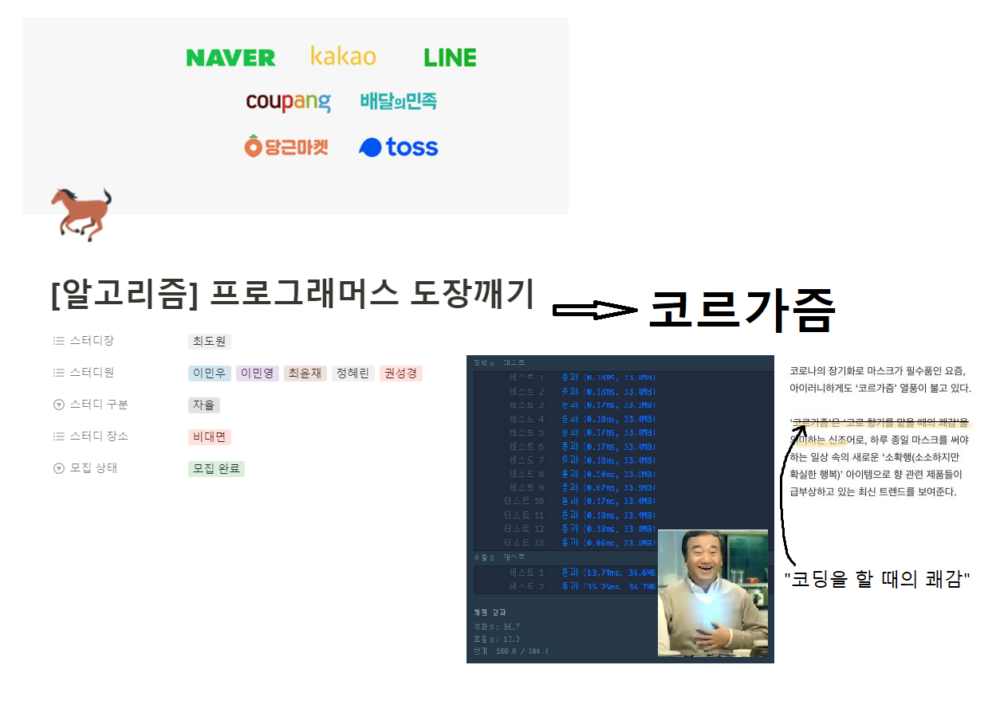
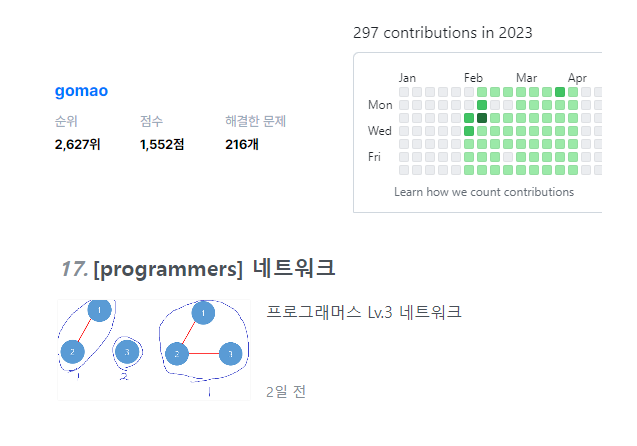

## 스터디 팀원 소개 : 코르가즘

## 스터디 목표

1. 프로그래머스 0~2단계 문제를 모두 해결하는 것을 목표로 합니다. (목표는 크게.)
2. 모임은 주 1회, 일요일 밤 10시에 진행 합니다. (전원 합의 하에 변경 가능)
3. 백준허브를 이용해서 푼 문제를 깃에 업로드하여 잔디를 꾸준히 심어봅시다.

## 스터디 진행방법

1. 매일 프로그래머스에서 n문제(단계에 따라 차등)를 해결하고 깃에 업로드 합니다.
   (매일 푼 문제를 일일-과제-인증 에 인증합니다!!)
2. 일주일에 1~2문제, 본인이 잘 풀었다고 생각하는 코드와, 다른 사람이 잘 풀었다고 생각하는 코드를 블로그에 포스팅합니다.
3. 모임 시간에는 기본적으로 코드 리뷰를 진행하고, 의견을 주고받는 시간을 가지려고 합니다.
   적어도 모임일 전날까지는 모임때 리뷰 할 문제를 미리 공유하고, 공유된 문제는 미리 읽고 이해해옵니다. (풀어보셔도 됩니다.)
4. 34주차부터는 코딩테스트 대회를 진행할 예정입니다.
   코딩테스트 대회란, 같은 문제를 하나 정해서 같은 시간동안 즉석에서 풀고 코드 리뷰까지 하는 것을 의미합니다.
   (약간 챌린징하게 프로그래머스 Lv23 정도면 좋겠습니다. 못 풀 경우, 집단지성으로 같이 풀어봐요!!)
5. 기타 진행에 관한 세부 사항은 협의 하에 조율 가능합니다.

## 스터디 성과

## 스터디에서 학습한 내용

## 스터디 소감

`최도원`

`이민우`

`이민영`

`최윤재`

`정혜린`

`권성경`
